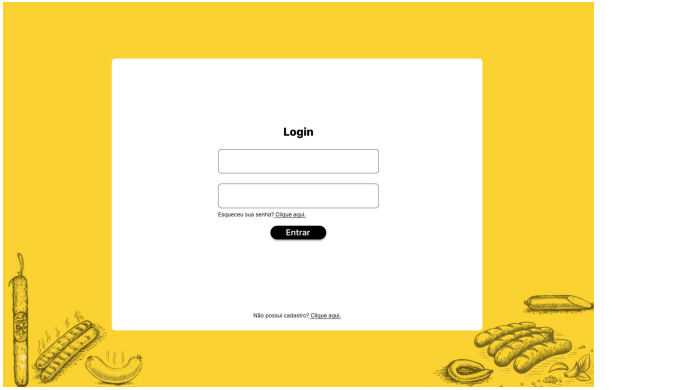
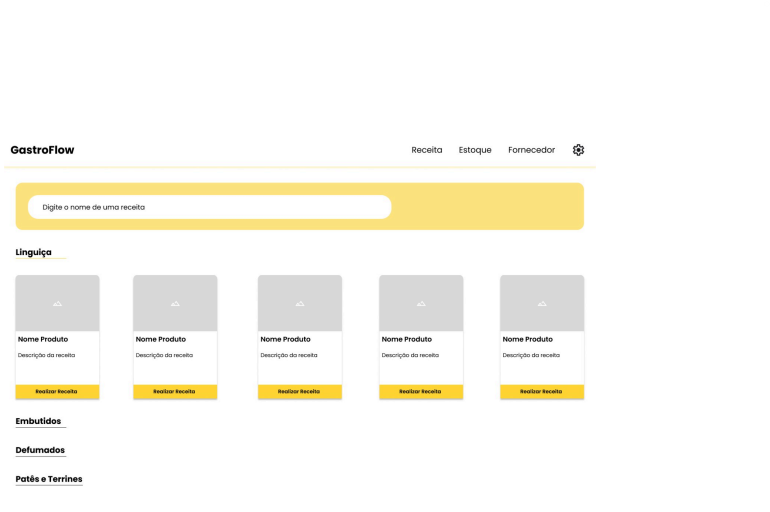
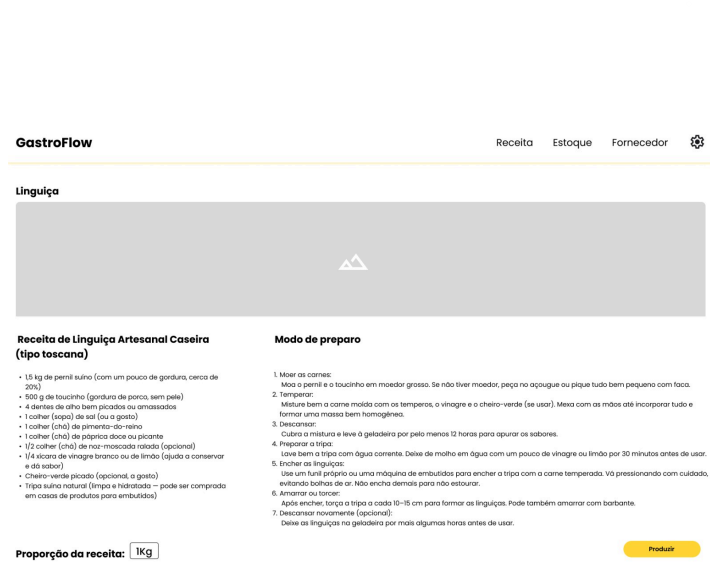
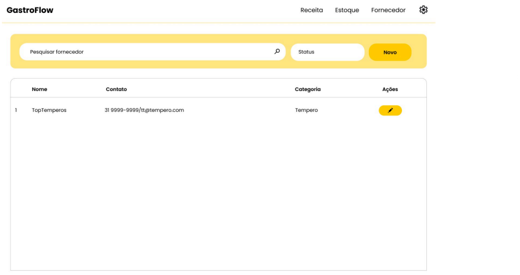
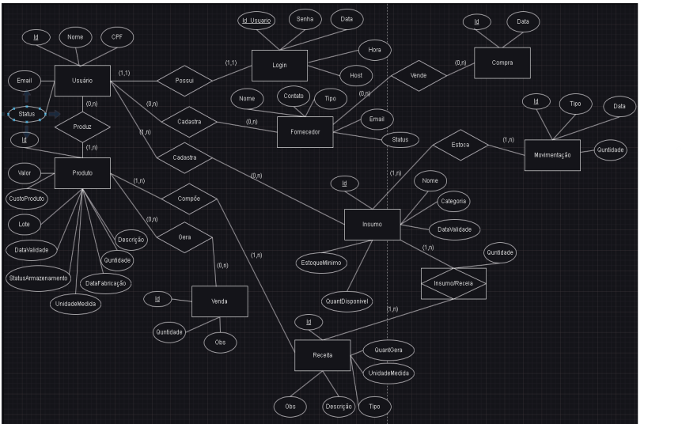

# Arquitetura da solução

Pré-requisitos: <a href="05-Projeto-interface.md"> Projeto de interface</a>

### Modelo ER

## Tecnologias

A arquitetura do sistema será baseada em uma aplicação web, desenvolvida em TypeScript, utilizando os frameworks Svelte, para construção de interfaces web modernas e reativas, e SvelteKit, que permite a criação de aplicações full-stack, integrando rotas, APIs e rendering no servidor de forma eficiente.
Como solução de banco de dados, será adotado o Turso, uma tecnologia distribuída baseada em SQLite, otimizada para alta performance, baixo custo e baixa latência em ambientes na nuvem. Alternativamente, poderá ser utilizado um banco de dados local, como SQLite ou SQL Server Compact, garantindo operação eficiente e manutenção simplificada.

| **Dimensão**   | **Tecnologia**  |
| ---            | ---             |
| Front-end      | Svelte |
| Back-end       | Svelte Kit (Node.js)         |
| SGBD           | Turso           |
| Deploy         | Vercel          |

> **Links úteis**:
> - [ISO/IEC 25010:2011 - Systems and Software Engineering — Systems and Software Quality Requirements and Evaluation (SQuaRE) — System and Software Quality Models](https://www.iso.org/standard/35733.html/)
> - [Análise sobre a ISO 9126 – NBR 13596](https://www.tiespecialistas.com.br/analise-sobre-iso-9126-nbr-13596/)
> - [Qualidade de software - Engenharia de Software](https://www.devmedia.com.br/qualidade-de-software-engenharia-de-software-29/18209)
